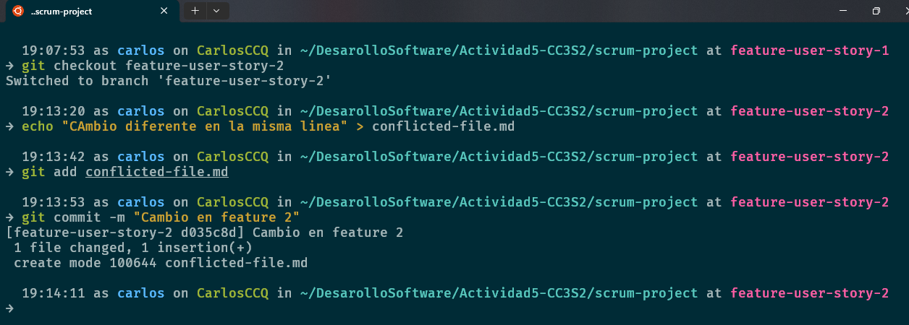

# Actividad: Entendiendo git rebase y git cherry-pick

Objetivo: Aprender a usar los comandos git rebase y git cherry pick para mantener un historial de commits limpio y manejable en proyectos colaborativos. También explorarás cuándo y por qué utilizar estos comandos en lugar de los merges regulares.

#### Rebase

Por ejemplo, considera las siguientes ramas:


Después de hacer rebase de la feature branch sobre main, tu rama podría verse así:


Finalmente, puedes fusionar de nuevo a main, en cuyo caso se puede realizar una fusión fast-forward:


##### Parte 1: git rebase para mantener un historial lineal
1. Introducción a Rebase:
EL rebase mueve tus commits a una nueva base, dándote un historial lineal y limpio. En lugar de fusionar ramas y mostrar un "commit de merge", el rebase integra los cambios aplicados en la parte superior de otra rama.

* Caso de uso: Simplificar la depuración y facilitar la comprensión del historial de commits.

2. Escenario de ejemplo:

* Crea un nuevo repositorio Git y dos ramas, main y new-feature:

```shell
    $ mkdir try-git-rebase
    $ cd try-git-rebase
    $ git init
    $ echo "# Mi proyecto de Rebase">README.md
    $ git add README.md
    $ git commit -m "Commit inicial en main"
```

Prueba:
Creación y posicionamiento en el nuevo repositorio try-git-rebase, inicializaremos git y crearemos el archivo README.md el cual al ser una modificación en el repositorio de git tendremos que prepararlo en el área de staging para posteriormente guardarlo con un commit.


* Crea y cambia a la rama 'new-feature':

```shell
    $ git checkout -b new-feature
    $ echo "Esta es una nueva caracteristica.">NewFeature.md
    $ git add NewFeature.md
    $ git commit -m "Agregar nueva caracteristica"
```

Prueba:
Crearemos la nueva rama 'new-feature' y luego nos posicionaremos en esta rama para crear el nuevo archivo NewFeature.md, al ser este un cambio lo prepararemos en el área de staging para que pueda ser guardado por un git commit.


En este punto, tu historial de ramas puede verse algo así:


Ahora, digamos que se han agregado nuevos comits a main mientras trabajamos en new-feature:
* Cambiar de nuevo a 'main' y agregar nuevos commits

```shell
    $ git checkout main
    $ echo "Updates to the project.">>Updates.md
    $ git add Updates.md
    $ git commit -m "Update main"
```

Prueba:
Nos posicionaremos en la rama 'main' y crearemos el archivo Updates.md, prepararemos esta modificación en el área de staging para que pueda ser guardada mediante un commit, en este caso el commit sera "Update main".


Tu gráfico de commits ahora diverge:


### Tarea: Realiza el rebase de new-feature sobre main con los siguientes comandos:

```shell
    $ git checkout new-feature
    $ git rebase main
```

Prueba:


3. Revisión:

Después de realizar el rebase, visualiza el historial ded commits con:

```shell
    $ git log --graph --oneline
```
Después de esto, tus ramas se verán como sigue:

Prueba:
Se observa que al hacer el rebase de la rama 'new-feature' sobre la rama 'main' pareciera que en historial de commit que se hubiera realizado los cambios de la rama 'new-feature' después de los cambios en la rama 'main' lo caul no es cierto porque las modificaciones se puedieron realizar en paralelo en las ramas.


4. Momento de fusionar y completar el proceso de git rebase:
* Cambiar a 'main' y realizar una fusión fast-forward

```shell
    $ git checkout main
    $ git merge new-feature
```

Prueba:
Se realizó la fusión de las ramas 'main' y 'feature'.


Cuando se realiza un fusión fast-forward, las HEADs de las ramas main y new-feature serán los commits correspondientes, como se muestra:


##### Parte 2: git cherry-pick para la integración selectiva de commit

1. Introucción a Cherry-pick:

git cherry-pick te permite selecionar commits individuales de una rama y aplicarlos en otra. Esto es útil cuando necesitas integrar una caracteristica o correción sin hacer merge de toda la rama.

Imagina que tienes dos ramas, main y feature. Te das cuenta de que uno o dos commits de la rama feature deberían moverse a main, pero no estás listo para fusionar toda la rama. El comando git cherry-pick te permite hacer precisamente eso:


Puedes hacer cherry-pcik de los cambios de un commit especifico en la rama feature y aplicarlos en la rama main. Esta acción creará un nuevo commit en la rama main.


2. Escenario de ejemplo:

* Inicializar un nuevo repositorio

```shell
    $ mkdir try-cherry-pick
    $ cd try-cherry-pick
    $ git init
```

Prueba:
Crearemos el nuevo repositorio llamado 'try-cherry-pick' seguidamente inicializaremos git en el repostirio.


* Agregar y commitear README.md inicial a main

```shell
    $ echo "# My Project">README.md
    $ git add README.md
    $ git commit -m "initial commit"
```

Prueba:
Se creó el archivo README.md, esta modificación en la rama main fue preparada en el área de staging para ser guardado mediante un commit.


* Crear y cambiar a una nueva rama 'add-base-documents'

```shell
    $ git checkout -b add-base-documents
```

Prueba:
Se creó la nueva rama 'add-base-documents' y seguidamente nos posicionamos en la nueva rama creada.


* Hacer cambios y commitearlos
* Agregar CONTRIBUTING.md

```shell
    $ echo "#CONTRIBUTING">>CONTRIBUTING.md
    $ git add CONTRIBUTING.md
    $ git commit -m "Add CONTRIBUTING.md"
```

Prueba:
En la rama 'add-base-contributing' se creó el archivo CONTRIBUTING.md, al haber realizado un modificación en esta rama tendremos que preparar este cambio en el área de staging para posteriormente guardarlo con un commit.


* Agregar LICENSE.txt

```shell
    $ echo "LICENSE">>LICENSE.txt
    $ git add LICENSE.txt
    $ git commit -m "Add LICENSE.txt"
```

Prueba:
Se creó el archivo LICENSE.txt en la rama 'add-base-documents', al ocurrir este cambio en la rama este tendra que ser preparado en el área de staging para luego ser guardado mediante un commit.


* Echa un vistazo al log de la rama 'add-base-documents'

```shell
    $ git log add-base-documents --graph --oneline
```

Ahora, las ramas se ven como las del siguiente diagrama:


3. Tarea: Haz cherry-pick de un commit de add-base-feature a main:

```shell
    $ git checkout main
    $ git cherry-pick 78047a0
```

Prueba:
Nos posicionamos en la rama 'main' y usamos cherry-pick para traer los cambios de un commit especifico a nuestra rama principal.


4. Revisión: Revisa el historial nuevamente:

```shell
    $ git log --graph --oneline
```

Después de que hayas realizado con éxito el cherry-pick del commit, se agegará un nuevo commit a tu rama actual (main en este ejemplo) y contendrá los cambios del commit cherry-picked.

Ten en cuenta que el nuevo commit tiene los mismos cmabios pero un valor de hash de commit diferente:


##### Preguntas de discusión:

1. ¿Por qué se considera que rebase es más útil para mantener un historial de proyecto lineal en comparación con merge?

El uso de git merge crea un commit adicional, esto puede tener varios propositos pero sobre todo se usa para especificar el motivo de la fusión o beneficios que traen integrar los cambios de diferentes ramas especificados mediante un commit. El git rebase es más útil porque mueve todo el historial de commit hacia después del último commit de la otra rama a fusionar esto hace que se mantenga un historial de commit lineal en comparación al merge.

2. ¿Qué problemas potenciales podrían surgir si haces rebase en una rama compartida con otros mienbros del equipo?

Primera mente si se trabaja en un rama copartida con varios miembros de un equipo esto podria causar problemas de fusion debido a que se podrían trabajar sobre los mismos archivos, su poniendo que no los mienbros no trabajen sobre los mismo archivos tendrián que tener una secuencia se fusión para que no ocurra errores de fusión.

3. ¿En qué se diferencia cherry-pick de merge, y en qué situaciones preferirías uno sobre el otro?

Usaría cherry-pick al querer fusionar cambios especificos de diferentes ramas, y usaria merge para fusionar todos los cambios de las diferentes ramas.

4. ¿Por qué es importante evitar hacer rebase en ramas públicas?

La fusión de tipo rebase ocurriría solo en mi repositorio local, y al querer enviar los cambios al repositorio remoto tendrian problemas de fusión con los demas cambios realizados.

##### Ejercicios teóricos

1. Diferencias entre git merge y git rebase

Pregunta: Explica la diferencia entre git merge y git rebase y describe en qué escenarios sería más adecuado utlizar cada uno en un equipo de desarrollo ágil que sigue las prácticas de Scrum.

Respuesta: En la fusión de git merge se mantiene el historial de ámbas ramas, además se genera un commit de fusión, y en la fusión de tipo rebase aplica todos los cambios realizados en un rama después del ultimo commit realizado en la otra rama a fusionar, esto puede sobrescribir los cambios importantes de la otra rama y perder lo realizado en la fusión rebase. Usaría la fusión merge cuando trabaje en ramas en paralelo, y usaría la fusión git rebase cuando solo trabaje en ramas que no sean la rama principal. En un equipo de desarrollo ágil que práctica Scrum lo más preferible sería usar la fusión de tipo merge.

2. Relación entre git rebase y DevOps

Pregunta: ¿Cómo crees que el uso de git rebase ayuda a mejorar las prácticas de DevOps, especialmente en la implementación continua (CI/CD)? Discute los beneficios de mantener un historial lineal en el contexto de una entrega continua de código y la automatización de pipelines.

Respuesta: Si, porque el uso de git rebase ayuda a mantener un flujo de trabajo eficiente y claro.
Git rebase ayuda a maneter un historial limpio y ayuda a evitar las fusiones merge innecesarias, git rebase ayuda a mantener un historial lineal, esto facilita la indentificacion de problemas usando git bisec que se encarga de localizar de manera rapida la confirmacion especifica que introdujo problemas en la aplicación. Esto es importante en CI/CD para resolver de manera rapida las fallas en los pipelines.
Al usar un rebase, las modificaciones locales se aplican sobre la última version de la rama principal, lo que reduce la probabilidad de conflictos al integrar cambios en el pipeline.

3. Impacto del git cherry-pick en un equipo Scrum

Pregunta: Un equipo Scrum ha finalizado un sprint, pero durante la integracion final a la rama principal (main) descubren que solo algunos commits especificos de la rama de una funcionalidad deber aplicarse a produccion. ¿Cómom podría ayudar git cherry-pick  en este caso? Explica los beneficios y posibles complicaiones.

Respuesta: La función de git cherry-pick es traer cambios especificos emplementados en alguna otra rama, las complicaciones que podria traer esto es si no se implemento los cambios en un solo archivo, el commit que se usara para el git cherry-pick pudo haber registrado o guardado la modificación en varios archivos entonces al usar git cherry-pick modificaria otros archivos en la rama principal lo que causaria un error.

##### Ejercicios prácticos

1. <b>Simulación de un flujo de trabajo Scrum con git rebase y git merge.</b>

Contexto:

* Tienes un raman main y una rama feature en la que trabajas. Durante el desarrollo del sprint, se han realizado commits tanto en main como en feature.

* Tu objetivo es integrar los cambios de la rama feature en main manteniendo un historial limpio.

Instrucciones:

1. Crea un repositorio y haz algunos commits en la rama main.
2. Crea una rama feature, agrega nuevos commits, y luego realiza algunos commits adicionales en main.
3. Realiza un rebase de feature sobre main.
4. Finalmente, realiza una fusión fast-forward de feature con main.

Preguntas:

* ¿Qué sucede con el historial de commits después del rebase?
* ¿En qué situación aplicarías una fusión fast-forward en un proyecto ágil?

Comandos:

```shell
    $ mkdir scrum-workflow
    $ cd scrum-workflow
    $ git init
    $ echo "Commit inicial en main">mainfile.md
    $ git add mainfile.md
    $ git commit -m "Commit inicial en main"
```

Prueba:
Creación y inicializacion de git en el repositorio scrum-workflow, se creo el archivo mainfile.md el cual su preparado en el área de staging para su posteriormente sea registrado o guardado por un commit.


```shell
    $ git checkout -b feature
    $ echo "Nueva caracteristica en feature">featurefile.md
    $ git add featurefile.md
    $ git commit -m "Commit en feature"
    $ git checkout main
    $ echo "Actualizacion en main">>mainfile.md
    $ git add mainfile.md
    $ git commit -m "Actualizacion en main"
```

Prueba:
Creamos la nueva rama 'feature' en el que desarollaremos una nueva caracteristica (featurefile.md), luego prepararemos featurefile.md en el área de staging este sera guardado o registrado mediante un commit. Luego, nos posicionaremos en la rama main y actualizaremos el archivo 'mainfile.md', este cambio será preparado en el área de staging para que sea guardado o registrado mediante un commit.


```shell
    $ git checkout feature
    $ git rebase main
    $ git checkout main
    $ git merge feature --ff-only
```

Prueba:
Rebasaremos los cambios hechos en la rama 'feature' sobre la rama 'main', esto quiero decir que todos los cambios realizados en la rama 'feature' irán o se posicionarán despues del ultimo commit realizado en la rama 'main', seguidamente haremos que el puntero de la rama 'main' apuente al mismo commit de la rama 'feature'.


* ¿Qué sucede con el historial de commits después del rebase?

Se consigue un historial más lineal, como si cada cambio se hubiera realizado despues de otro.

* ¿En qué situcación aplicarías una fusión fast-forward en un proyecto ágil?

Cuando se quieran integrar cambios en una rama el cual no ha sufrido modificaciones desde el commit en el que se origino dicha rama, esto permite el avance rapido  ya que no hay trabajos divergentes a fusionar.

2. <b>Cherry-pick para integración selectiva en un pipeline CI/CD</b>

Contexto:

* Durante el desarrollo de una funcionalidad, te das cuenta de que solo ciertos cambios deben ser integrados en la rama producción, ya que el resto aún está en desarrollo. Para evitar fusionar toda la rama, decides hacer cherry-pick de los commits que ya están listos para producción.

Instrucciones:
1. Crea un repositorio con una rama main y una rama feature.
2. Haz varios commits en la rama feature, pero solo selecciona uno o dos commits específicos que consideres listos para producción.
3. Realiza un cherry-pick de esos commits desde feature a main.
4. verifica que los commits cherry-picked aparezcan en main.

Preguntas:

* ¿Comó utilizarías cherry-pick en un pipeline de CI/CD para mover solo ciertos cmabios listos a producción?

* ¿Qué ventajas ofrece cherry-pick en un flujo de trabajo de DevOps?

Comandos:

```shell
    $ mdkir ci-cd-workflow
    $ cd ci-cd-workflow
    $ git init 
    $ echo "Commit inicial en main" > mainfile.md
    $ git add mainfile.md
    $ git commit -m "Commit inicial en main"
```

Prueba:
Creación y inicialización de git en el repositorio 'ci-cd-workflow', se crea el archivo mainfile.md en la rama main el cual será preparado en el área de staging para posteriormente ser guardado o registrado mediante un commit.


```shell
    $ git checkout -b feaeture
    $ echo "Primera caracteristica" > feature1.md
    $ git add feature1.md
    $ git commit -m "Agregar primera caracteristica"
```

Prueba:
Creamos la rama 'feature' y luego nos posicionamos en esta rama, creamos el archivo feature1.md el cual hace referencia a la creación de una primera caracteristica en esta rama, seguidamente preparamos el feature1.md en el área de staging para luego guardarlo o registrarlo mediante un commit.


```shell
    $ echo "Segunda caracteristica">feature2.md
    $ git add feature2.md
    $ git commit -m "Agreagar segunda caracteristica"
```

Prueba:
Se simula la creación de una segunda caracterisitca en la rama 'feature' con el archivo feature2.md, este cambio será preparado en el área de staging y posteriormente registrado o guardado mediante un commit.


```shell
    $ git checkout main
    $ git cherry-pick <hash_del_commit>
    $ git cherry-pick <hash del commit>
```

Prueba:
Se utiliza git cherry-pick para agregar los cambios de la rama 'feature' en la rama 'main' de acuerdo al orden cronologio en el que fueron creados en la rama 'feature'.


#### Git, Scrum y Sprints

##### Fase 1: Planificación del sprint(Sprint planning)

##### Ejercicio 1: Crear ramas de funcionalidades (feature branches)

En esta fase del sprint, los equipos Scrum deciden qué historias de usuario van a trabajar. Cada historia de usuario puede representarse como una rama de funcionalidad.

Objetivo: Crear ramas para cada historia de usuario y asegurar que el trabajo se mantenga aislado.

Instrucciones:
1. Crea un repositorio en Git.
2. Crea una rama main donde estará el código base.
3. Crea una rama por cada historia de usuario asignada al sprint, partiendo de la rama main.

Comandos:

```shell
    $ mkdir scrum-project
    $ cd scrum-project
    $ git init
    $ echo "# Proyecto Scrum" > README.md
    $ git add README.md
    $ git commit -m "Commit inicial en main"
```

Prueba:
Se crea el repositorio 'scrum-project' en el cual inicializaremos git, en el repositorio crearemos un archivo 'README.md', este cambio en la rama main sera preparado en el área de stagin mediante un git add, luego registraremos o guardaremos estos cambios mediante un git commit.


* Crear ramas de historias de usuario

```shell
    $ git checkout -b feature-user-story-1
    $ git checkout main
    $ git checkout -b feature-user-story-2
```

Prueba:
A partir del commit inicial de la rama main se crearon las ramas 'feature-user-story-1' y 'feature-user-story-2'.


Pregunta: ¿Por qué es importante trabajar en ramas de funcionalidades separadas durante un sprint?

Porque permite el desarrollo ágil de aplicaciones al separar rsponsabilidades en cada rama, eto tambien permite un menor numero de conflictos, más facil la correción de errores, un historial más claro, una revisión de codigo más clara.

##### Fase 2: Desarrollo del sprint (sprint execution)
##### Ejercicio 2: Integración continua con git rebase

A medida que los desarrolladores trabajan en sus respectivas historias de usuario, pueden ocurrir cambios en main. Para mentener un historial lineal y evitar conflictos más adelante, se usa git rebase para integrar los ultimos cambios de main en las ramas de funcionalidad antes de finalizar el sprint.

Objetivo: Mantener el código de la rama funcionalidad actualizado con los ultimos cambios de main durante el sprint.

Instrucciones:
1. Haz algunos commits en main.
2. Realiza un rebase de la rama feature-user-story-1 para actualizar su base con los últimos cambios de main.

Comandos:

* Simual cambios en la rama main
```shell
    $ git checkout main
    $ echo "Actualizaciones en main" > updates.md
    $ git add updates.md
    $ git commit -m "Actualizar main con nuevas funcionalidades"
```

Prueba:
Nos posicionamos en la rama principal main y en el cual simularemos la realización de una actualizacion con el archivo 'updates.md', seguidamente prepararemos estos cambios en el área de staging para que posteriormente sea guardado o registrado mediante un commit.


* Rebase de la rama feature-user-story-1 sobre main

```shell
    $ git checkout feature-user-story-1
    $ git rebase main
```

Prueba:
Visualizamos las ramas y luego nos posicionamos en la rama 'feature-user-story-1', una vez pisicionada en la rama hacemos un git rebase de la rama 'feature-user-story-1' sobre la rama 'main' para conservar los cambios de la rama 'main' y que los cambios realizados en la rama 'feature-user-story-1' apunten a un nuevo commit de inicio.


Pregunta: ¿Qué ventajas proporciona el rebase durante el desarrollo de un sprint en términos de integración continua?

Los cambios realizados se pueden conservar sin necesidad de un merge, esto facilita el uso de agregar más cambios a una rama sin modificar la estructura de otras ramas.

##### Fase 3: Revisión del sprint (sprint review)

##### Ejercicio 3: Integración selectiva con git cherry-pick

En esta fase, es posible que algunas funcionalidades estén listas para ser mostrada a los stakeholfers, pero otras aún no están completamente implementadas. Usar git cherry-pick puede permitirte seleccionar commit especificos para mostrar las funcinalidades listas, sin hacer merge de ramas incompletas.

Objetivo: Mover commits seleccionados de una rama de funcionalidad (feature-user-story-2) a main sin integrar todos los cambios.

Instrucciones:
1. Realiza algunos commits en feature-user-story-2.
2. Haz cherry-pick de los commits que estén listos para mostrarse a los stakeholders durante la revisión del sprint.

Comandos:

```shell
    $ git checkout feature-user-story-2
    $ echo "Funcionalidad lista" > feature2.wmd
    $ git add feature2.md
    $ git commit -m "Funcionalidad lista para revisión"
    $ echo "Funcionalidad en progreso">progress.md
    $ git add progress.md
    $ git commit -m "Funcionalidad en progreso"
```

Prueba:
Nos posicionamos en la rama 'feature-user-story-2' y simulamos el termino de una funcionalidad y el progreso de otra, preparamos cada archivo por separado en el staging y luego lo guardmos o registramos con su respectivo commit.


* Ahora selecciona solo el commit que esté listo
```shell
    $ git checkout main
    $ gt cherry-pick <hash_del_commit_de_feature_lista>
```

Prueba:
Usamos git log --graph --oneline para encontrar el commit de la 'Funcionalidad lista para revision', nos posicionamos en la rama main y luego usamos cherry-pick para traer todos los cambios que involucren el commit de 'Funcionalidad lista para revisión'.


Pregunta: ¿Cómo ayuda git cherry-pick a mostrar avances de forma selectiva en un sprint review?


##### Fase 4: Retrospectiva del sprint (sprint retrospective)
##### Ejercicio 4: Revisión de conflictos y resolución

Durante un sprint, pueden surgir conflictos al intentar integrar diferentes ramas de funcionalidad. Es importante aprender cómo resolver estos conflictos y discutirlos en la retrospectiva.

Objetivo: Identificar y resolver conflictos de fusión con git merge al intentar integrar varias ramas de funcionalidad al final del sprint.

Instrucciones:
1. Realiza cambios en feature-user-story-1 y feature-user-story-2 que resulten en conflictos.
2. Intentar hacer merge de ambas ramas con main y resuelve los conflictos.

Comandos:
```shell
    $ git checkout feature-user-story-1
    $ echo "Camnbio en la misma linea" > conflicted-file.md
    $ git add conflicted-file.md
    $ git commit -m "Cambio en feature 1"
```

Prueba:
Nos posicionamos en la rama 'feature-user-story-1' y simulamos un cambio realizado en la mima linea con conlicted-file.md, preparamos este cambio en el staging y posteriormente los guardamos o registramos con un commit.


```shell
    $ git checkout feature-user-story-2
    $ echo "Cambio diferente en la misma línea" > conflicted-file.md
    $ git add conflicted-file.md
    $ git commit -m "Cambio en feature 2"
```

Prueba:
Nos posicionamos en la rama 'feature-user-story-2' y realizamos un cambio en la misma linea del archivo conflicted-file.md realizado en la rama 'feature-user-story-1', guardamos estos cambios en el staging y luego lo guardamos o registramos con un commit.



* Intentar hacer un merge en main

```shell
    $ git checkout main
    $ git merge feature-user-story-1
    $ git merge feature-user-story-2
```

Prueba:
Nos poscionamos en la rama 'main' y fusinamos esta rama con la rama 'feature-user-story-1', esto nos pedira un commit de fusión el cual tambien realizaremos. En la rama 'main' intentaremos fusionar los cambios realizados en la rama 'feature-user-story-2', esto nos dara un problema debido a que se se hicieron modificaciones en la misma linea, esto problema o conflicto de fusion tendra que ser resuelto manualmente, se usara el editor de texto VIM, una vez resueltos estos problemas de fusión se prepararán estos cambios en en área de staging y luego serán guardados o registrados mediante un commit de fusión.


Visualización del historial de commits:


Pregunta: ¿Cómo manejas los conflictos de fusión al final de un sprint? ¿Cómo puede el equipo mejorar la comunicación para evitar conflictos grandes?

Los conflictos de fusión se tienen que manejar de manera manual, esto es editando cada archivo que se quiera fusionar para resolver los conflictos. Los equipos deben tener metricas claras para evitar problemas de fusión aun mayores.

##### Fase de desarrollo: automatización de integración continua (CI) con git rebase

##### Ejercicio 5: Automatización de rebase con hooks de Git

En un entorno CI, es común automatizar ciertas operaciones de Git para asegurar que el código se mantenga limpio antes de que pase a la siguiente fase del pipeline. Usa los hooks de Git para automatizar el rebase cada vez que se haga un push a una rama de funcionalidad.

Objetivo: Implementar un hook que haga automáticamente un rebase de main antes de hacer push en una rama de funcionalidad, asegurando que el historial se mantenga limpio.

Instrucciones:
1. Configura un hook pre-push que haga un rebase automático de la rama main sobre la rama funcionalidad antes de que el push sea exitoso.
2. Prueba el hook haciendo push de algunos cambios en la rama feature-user-story-1.

Comandos:

* Dentro de tu proyecto, crea un hook pre-push

```shell
    $ nano .git/hooks/pre-push
```
* Agrega el siguiente script para automatizar el rebase

```shell
    #!/bin/zsh
    git fetch origin main
    git rebase origin/main
```

Prueba:
Se crea el directorio .git/hooks/pre-push en el cual desarrollaremos un  script con el cual optimizaremos el suo de git rebase.


* Haz el archivo ejecutable

```shell
    $ chmod +x .git/hooks/pre-push
```

* Simula cambios y haz push
```shell
    $ git checkout feature-user-story-1
    $ echo "Cambios importantes" > feature1.md
    $ git add feature1.md
    $ git commit -m "Cambios importantes en feature 1"
    $ git push origin feature-user-story-1
```

Prueba:


Pregunta: ¿Qué ventajas y desventajas observas al automatizar el rebase en un entorno de CI/CD?

Se usa una menor cantidad de merge commits, también se evitan los errores por diferencia de sincronización, mejor integración con CI/CD por por que el código es más compatible con los pipelines de integración continua por siempre se trabajria con la ultima versión del código.