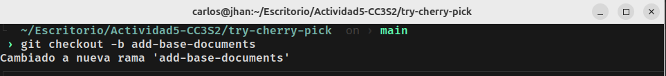

# Actividad: Entendiendo git rebase y git cherry-pick

Objetivo: Aprender a usar los comandos git rebase y git cherry pick para mantener un historial de commits limpio y manejable en proyectos colaborativos. También explorarás cuándo y por qué utilizar estos comandos en lugar de los merges regulares.

#### Rebase

Por ejemplo, considera las siguientes ramas:


Después de hacer rebase de la feature branch sobre main, tu rama podría verse así:


Finalmente, puedes fusionar de nuevo a main, en cuyo caso se puede realizar una fusión fast-forward:


##### Parte 1: git rebase para mantener un historial lineal
1. Introducción a Rebase:
EL rebase mueve tus commits a una nueva base, dándote un historial lineal y limpio. En lugar de fusionar ramas y mostrar un "commit de merge", el rebase integra los cambios aplicados en la parte superior de otra rama.

* Caso de uso: Simplificar la depuración y facilitar la comprensión del historial de commits.

2. Escenario de ejemplo:

* Crea un nuevo repositorio Git y dos ramas, main y new-feature:

```shell
    $ mkdir try-git-rebase
    $ cd try-git-rebase
    $ git init
    $ echo "# Mi proyecto de Rebase">README.md
    $ git add README.md
    $ git commit -m "Commit inicial en main"
```

Prueba:
Creación y posicionamiento en el nuevo repositorio try-git-rebase, inicializaremos git y crearemos el archivo README.md el cual al ser una modificación en el repositorio de git tendremos que prepararlo en el área de staging para posteriormente guardarlo con un commit.


* Crea y cambia a la rama 'new-feature':

```shell
    $ git checkout -b new-feature
    $ echo "Esta es una nueva caracteristica.">NewFeature.md
    $ git add NewFeature.md
    $ git commit -m "Agregar nueva caracteristica"
```

Prueba:
Crearemos la nueva rama 'new-feature' y luego nos posicionaremos en esta rama para crear el nuevo archivo NewFeature.md, al ser este un cambio lo prepararemos en el área de staging para que pueda ser guardado por un git commit.


En este punto, tu historial de ramas puede verse algo así:


Ahora, digamos que se han agregado nuevos comits a main mientras trabajamos en new-feature:
* Cambiar de nuevo a 'main' y agregar nuevos commits

```shell
    $ git checkout main
    $ echo "Updates to the project.">>Updates.md
    $ git add Updates.md
    $ git commit -m "Update main"
```

Prueba:
Nos posicionaremos en la rama 'main' y crearemos el archivo Updates.md, prepararemos esta modificación en el área de staging para que pueda ser guardada mediante un commit, en este caso el commit sera "Update main".


Tu gráfico de commits ahora diverge:


### Tarea: Realiza el rebase de new-feature sobre main con los siguientes comandos:

```shell
    $ git checkout new-feature
    $ git rebase main
```

Prueba:


3. Revisión:

Después de realizar el rebase, visualiza el historial ded commits con:

```shell
    $ git log --graph --oneline
```
Después de esto, tus ramas se verán como sigue:

Prueba:
Se observa que al hacer el rebase de la rama 'new-feature' sobre la rama 'main' pareciera que en historial de commit que se hubiera realizado los cambios de la rama 'new-feature' después de los cambios en la rama 'main' lo caul no es cierto porque las modificaciones se puedieron realizar en paralelo en las ramas.


4. Momento de fusionar y completar el proceso de git rebase:
* Cambiar a 'main' y realizar una fusión fast-forward

```shell
    $ git checkout main
    $ git merge new-feature
```

Prueba:
Se realizó la fusión de las ramas 'main' y 'feature'.


Cuando se realiza un fusión fast-forward, las HEADs de las ramas main y new-feature serán los commits correspondientes, como se muestra:


##### Parte 2: git cherry-pick para la integración selectiva de commit

1. Introucción a Cherry-pick:

git cherry-pick te permite selecionar commits individuales de una rama y aplicarlos en otra. Esto es útil cuando necesitas integrar una caracteristica o correción sin hacer merge de toda la rama.

Imagina que tienes dos ramas, main y feature. Te das cuenta de que uno o dos commits de la rama feature deberían moverse a main, pero no estás listo para fusionar toda la rama. El comando git cherry-pick te permite hacer precisamente eso:


Puedes hacer cherry-pcik de los cambios de un commit especifico en la rama feature y aplicarlos en la rama main. Esta acción creará un nuevo commit en la rama main.


2. Escenario de ejemplo:

* Inicializar un nuevo repositorio

```shell
    $ mkdir try-cherry-pick
    $ cd try-cherry-pick
    $ git init
```

Prueba:
Crearemos el nuevo repositorio llamado 'try-cherry-pick' seguidamente inicializaremos git en el repostirio.


* Agregar y commitear README.md inicial a main

```shell
    $ echo "# My Project">README.md
    $ git add README.md
    $ git commit -m "initial commit"
```

Prueba:
Se creó el archivo README.md, esta modificación en la rama main fue preparada en el área de staging para ser guardado mediante un commit.


* Crear y cambiar a una nueva rama 'add-base-documents'

```shell
    $ git checkout -b add-base-documents
```

Prueba:
Se creó la nueva rama 'add-base-documents' y seguidamente nos posicionamos en la nueva rama creada.



* Hacer cambios y commitearlos
* Agregar CONTRIBUTING.md

```shell
    $ echo "#CONTRIBUTING">>CONTRIBUTING.md
    $ git add CONTRIBUTING.md
    $ git commit -m "Add CONTRIBUTING.md"
```

Prueba:
En la rama 'add-base-contributing' se creó el archivo CONTRIBUTING.md, al haber realizado un modificación en esta rama tendremos que preparar este cambio en el área de staging para posteriormente guardarlo con un commit.


* Agregar LICENSE.txt

```shell
    $ echo "LICENSE">>LICENSE.txt
    $ git add LICENSE.txt
    $ git commit -m "Add LICENSE.txt"
```

Prueba:
Se creó el archivo LICENSE.txt en la rama 'add-base-documents', al ocurrir este cambio en la rama este tendra que ser preparado en el área de staging para luego ser guardado mediante un commit.


* Echa un vistazo al log de la rama 'add-base-documents'

```shell
    $ git log add-base-documents --graph --oneline
```

Ahora, las ramas se ven como las del siguiente diagrama:


3. Tarea: Haz cherry-pick de un commit de add-base-feature a main:

```shell
    $ git checkout main
    $ git cherry-pick 78047a0
```

Prueba:
Nos posicionamos en la rama 'main' y usamos cherry-pick para traer los cambios de un commit especifico a nuestra rama principal.


4. Revisión: Revisa el historial nuevamente:

```shell
    $ git log --graph --oneline
```

Después de que hayas realizado con éxito el cherry-pick del commit, se agegará un nuevo commit a tu rama actual (main en este ejemplo) y contendrá los cambios del commit cherry-picked.

Ten en cuenta que el nuevo commit tiene los mismos cmabios pero un valor de hash de commit diferente:


##### Preguntas de discusión:

1. ¿Por qué se considera que rebase es más útil para mantener un historial de proyecto lineal en comparación con merge?

El uso de git merge crea un commit adicional, esto puede tener varios propositos pero sobre todo se usa para especificar el motivo de la fusión o beneficios que traen integrar los cambios de diferentes ramas especificados mediante un commit. El git rebase es más útil porque mueve todo el historial de commit hacia después del último commit de la otra rama a fusionar esto hace que se mantenga un historial de commit lineal en comparación al merge.

2. ¿Qué problemas potenciales podrían surgir si haces rebase en una rama compartida con otros mienbros del equipo?

Primera mente si se trabaja en un rama copartida con varios miembros de un equipo esto podria causar problemas de fusion debido a que se podrían trabajar sobre los mismos archivos, su poniendo que no los mienbros no trabajen sobre los mismo archivos tendrián que tener una secuencia se fusión para que no ocurra errores de fusión.

3. ¿En qué se diferencia cherry-pick de merge, y en qué situaciones preferirías uno sobre el otro?

Usaría cherry-pick al querer fusionar cambios especificos de diferentes ramas, y usaria merge para fusionar todos los cambios de las diferentes ramas.

4. ¿Por qué es importante evitar hacer rebase en ramas públicas?

La fusión de tipo rebase ocurriría solo en mi repositorio local, y al querer enviar los cambios al repositorio remoto tendrian problemas de fusión con los demas cambios realizados.

##### Ejercicios teóricos

1. Diferencias entre git merge y git rebase

Pregunta: Explica la diferencia entre git merge y git rebase y describe en qué escenarios sería más adecuado utlizar cada uno en un equipo de desarrollo ágil que sigue las prácticas de Scrum.

Respuesta: En la fusión de git merge se mantiene el historial de ámbas ramas, además se genera un commit de fusión, y en la fusión de tipo rebase aplica todos los cambios realizados en un rama después del ultimo commit realizado en la otra rama a fusionar, esto puede sobrescribir los cambios importantes de la otra rama y perder lo realizado en la fusión rebase. Usaría la fusión merge cuando trabaje en ramas en paralelo, y usaría la fusión git rebase cuando solo trabaje en ramas que no sean la rama principal. En un equipo de desarrollo ágil que práctica Scrum lo más preferible sería usar la fusión de tipo merge.

2. Relación entre git rebase y DevOps

Pregunta: ¿Cómo crees que el uso de git rebase ayuda a mejorar las prácticas de DevOps, especialmente en la implementación continua (CI/CD)? Discute los beneficios de mantener un historial lineal en el contexto de una entrega continua de código y la automatización de pipelines.